# Contexto del Proyecto: CardLink

> Desarrollado por **Merino Tech Systems** · Piedras Negras, Coahuila, México

---

## 1. Propósito del Negocio

| Campo | Valor |
|-------|-------|
| **Problema que resuelve** | Negocios y profesionales locales dependen de tarjetas físicas que se pierden, se desactualizan y no generan datos — CardLink las reemplaza con una tarjeta digital profesional con QR y NFC |
| **Modelo de negocio** | **Servicio gestionado** — MTS recopila info del cliente, diseña la tarjeta y la entrega. Opcionalmente se imprime tarjeta física con QR + NFC |
| **Canales de captación** | Página web cardlink.mx · Redes sociales (Instagram, Facebook) |
| **Entregables al cliente** | 1) Link compartible de su tarjeta digital 2) Tarjeta física impresa con QR y chip NFC (opcional) |
| **Métrica de éxito** | Cliente recibe su tarjeta lista en < 48h desde que entrega su información; tarjeta pública carga en < 2s |
| **Patrocinador** | Merino Tech Systems (producto propio) |
| **Fecha de Discovery** | 2026-05-07 · Actualizado 2026-05-15 |
| **Confirmación** | ✅ Confirmado — modelo de servicio gestionado por MTS |

---

## 2. Usuarios y Roles

| Rol | Descripción | Necesidad principal | Frecuencia de uso |
|-----|-------------|---------------------|-------------------|
| **Cliente / Negocio** | Empresa, profesional o negocio local que contrata CardLink | Tener una tarjeta digital profesional lista sin saber de tecnología | 1 vez (contrata) · ocasional (pide cambios) |
| **Equipo MTS / Admin** | Staff de Merino Tech Systems | Recopilar info del cliente, crear y entregar la tarjeta desde el panel /admin | Diario durante operación |
| **Visitante / Receptor** | Cliente final del negocio que escanea el QR o toca el NFC | Ver información del negocio · llamar · ir a WhatsApp · ver redes | Una sola vez por contacto |
| **Prospecto** | Persona que vio el anuncio o la web y quiere informes | Conocer precios y proceso | Único (se convierte en Cliente o no) |

---

## 3. Flujo Principal del Negocio

**Modelo:** Servicio gestionado — MTS opera como agencia, el cliente no necesita saber de tecnología.

**Evento disparador:** Un prospecto ve cardlink.mx o redes sociales y contacta a MTS

```
FASE 1 — CAPTACIÓN
  Prospecto ve anuncio/web → Contacta a MTS vía WhatsApp/formulario → Solicita información

FASE 2 — ONBOARDING DEL CLIENTE
  Equipo MTS envía brief al cliente:
    → Nombre y giro del negocio
    → Logo en alta resolución
    → Servicios / productos principales
    → Teléfono, WhatsApp, email
    → Redes sociales
    → Dirección + enlace Google Maps
    → Colores de marca (si los tiene)
    → Cualquier elemento visual relevante

FASE 3 — PRODUCCIÓN
  Equipo MTS crea 1 o 2 propuestas de diseño en el panel /admin
    → Selecciona plantilla (clásica, tattoo, vet, travel u otra)
    → Sube logo y foto
    → Llena todos los campos del cliente
    → Genera preview de la tarjeta

FASE 4 — REVISIÓN Y APROBACIÓN
  MTS envía links de propuestas al cliente
    → Cliente revisa y selecciona (o pide ajuste menor)
    → Máximo 2 rondas de cambios incluidas

FASE 5 — ENTREGA DIGITAL
  Cliente recibe:
    → 🔗 Link permanente: cardlink.mx/[slug]
    → 📱 QR descargable en PNG
    → 💬 Link de WhatsApp para compartir fácilmente

FASE 6 — ENTREGA FÍSICA (opcional / plus)
  MTS gestiona impresión de tarjeta física:
    → QR impreso en la tarjeta → apunta a cardlink.mx/[slug]
    → Chip NFC embebido → al acercar un teléfono abre la tarjeta digital
    → Tarjeta enviada físicamente al cliente
```

**Salida del proceso:** Tarjeta digital activa en URL permanente + (opcional) tarjeta física NFC+QR en manos del cliente

---

## 3.1 Diagrama de Flujo Completo

```mermaid
flowchart TD
    %% ─── CAPTACIÓN ─────────────────────────────────────────────────────────
    subgraph CAPTACION ["📣 Captación"]
        A1([🌐 Página Web\ncardlink.mx]) --> C1
        A2([📱 Redes Sociales\nIG · FB]) --> C1
        C1{Prospecto\ninteresado} -->|Contacta por WhatsApp\no formulario| B1
    end

    %% ─── ONBOARDING ─────────────────────────────────────────────────────────
    subgraph ONBOARDING ["📋 Onboarding del Cliente"]
        B1([Equipo MTS\nrecibe contacto]) --> B2[Envía brief\nal cliente]
        B2 --> B3[Cliente entrega:\n📄 Nombre · Giro\n🖼️ Logo · Foto\n📞 Tel · WhatsApp · Email\n🌐 Redes sociales\n📍 Dirección + Google Maps\n🎨 Colores de marca]
        B3 --> B4{¿Info\ncompleta?}
        B4 -- ❌ Falta info --> B2
        B4 -- ✅ Completa --> P1
    end

    %% ─── PRODUCCIÓN ─────────────────────────────────────────────────────────
    subgraph PRODUCCION ["⚙️ Producción (Panel /admin MTS)"]
        P1([Admin MTS\nentra al panel]) --> P2[Crea 1 o 2\npropuestas de diseño]
        P2 --> P3{Tipo de\ntarjeta}
        P3 -->|Diseño estándar| P4[CardPreview\nclásica]
        P3 -->|Diseño premium| P5[DesignCardPreview\ntattoo · vet · travel]
        P4 --> P6[Sube logo + foto\na Firebase Storage]
        P5 --> P6
        P6 --> P7[Guarda en\nFirestore]
        P7 --> P8[Genera links\nde propuesta]
    end

    %% ─── REVISIÓN ───────────────────────────────────────────────────────────
    subgraph REVISION ["🔍 Revisión y Aprobación"]
        P8 --> R1[MTS envía propuestas\nal cliente por WhatsApp]
        R1 --> R2{¿Cliente\naprueba?}
        R2 -- ❌ Ajuste menor --> R3[MTS aplica\ncambio en /admin]
        R3 --> R1
        R2 -- ✅ Aprobada --> E1
    end

    %% ─── ENTREGA DIGITAL ────────────────────────────────────────────────────
    subgraph ENTREGA_D ["📲 Entrega Digital"]
        E1([Tarjeta aprobada\nen Firestore]) --> E2[Cliente recibe:\n🔗 cardlink.mx/slug\n📱 QR en PNG\n💬 Link WhatsApp para compartir]
        E2 --> E3{¿Quiere\ntarjeta física?}
        E3 -- ❌ No --> FIN1([✅ Entrega completa\nservicio digital])
        E3 -- ✅ Sí → plus --> F1
    end

    %% ─── ENTREGA FÍSICA ─────────────────────────────────────────────────────
    subgraph ENTREGA_F ["🃏 Entrega Física (Plus)"]
        F1([MTS gestiona\nimpresión]) --> F2[Tarjeta impresa con:\n◼ QR → cardlink.mx/slug\n◼ Chip NFC → abre tarjeta digital]
        F2 --> F3[Envío físico\nal cliente]
        F3 --> FIN2([✅ Entrega completa\ndigital + física NFC])
    end

    %% ─── VISITANTE FINAL ────────────────────────────────────────────────────
    subgraph VISITANTE ["👁️ Visitante Final (cliente del negocio)"]
        V1([Escanea QR\no toca NFC]) --> V2{¿Tarjeta\nexiste?}
        V2 -- ❌ --> V3[Página 404\nCTA: crea tu tarjeta]
        V2 -- ✅ --> V4{¿Tiene\ndiseño premium?}
        V4 -- No --> V5[CardPreview\nclásica]
        V4 -- Sí --> V6[DesignCardPreview\npremium]
        V5 --> V7[Acciones:\n📞 Llamar · 💬 WhatsApp\n🌐 Redes · 📧 Email\n📍 Google Maps]
        V6 --> V7
        V7 --> V8[(Analytics:\nregistra clicks)]
    end

    %% ─── CONEXIONES ENTRE FASES ─────────────────────────────────────────────
    FIN1 -.->|Cliente comparte su link| V1
    FIN2 -.->|Clientes del negocio usan tarjeta física| V1
    E2 -.->|comparte con sus clientes| V1

    %% ─── ESTILOS ────────────────────────────────────────────────────────────
    classDef success fill:#10B981,color:#fff,stroke:none
    classDef error fill:#EF4444,color:#fff,stroke:none
    classDef mts fill:#6366F1,color:#fff,stroke:none
    classDef infra fill:#1e1e2e,color:#94a3b8,stroke:#6366F1
    classDef endpoint fill:#0A0A0F,color:#F1F5F9,stroke:#6366F1,stroke-width:2px
    classDef plus fill:#F59E0B,color:#0A0A0F,stroke:none

    class FIN1,FIN2 success
    class V3 error
    class P1,B1,R3 mts
    class V8 infra
    class A1,A2,V1 endpoint
    class F1,F2,F3 plus
```



---

## 4. Flujos Alternos

| Situación | Comportamiento esperado | Responsable |
|-----------|-------------------------|-------------|
| Cliente pide ajuste menor en propuesta | MTS aplica el cambio y reenvía link (máx 2 rondas incluidas) | Equipo MTS |
| Slug ya existe al crear tarjeta | Admin MTS elige slug alternativo desde el panel | Equipo MTS |
| Cliente no entrega info completa | MTS bloquea producción hasta recibir todo el brief | Equipo MTS |
| Visitante escanea QR pero slug inválido | Página 404 con CTA para conocer CardLink | Sistema |
| Firebase no disponible | Mensaje de error amigable, no pantalla blanca | Sistema |
| Foto > 5MB al subir | Error antes de subir, con tamaño máximo indicado | Sistema |
| NFC no compatible con el teléfono del visitante | Visitante usa el QR impreso como alternativa | Diseño físico |

---

## 5. Reglas de Negocio

| ID | Regla | Prioridad |
|----|-------|-----------|
| REGLA-001 | SI el cliente no entrega el brief completo ENTONCES MTS no inicia producción | Alta |
| REGLA-002 | SI el slug ya existe ENTONCES el admin MTS elige uno diferente desde el panel | Alta |
| REGLA-003 | SI foto > 5MB ENTONCES rechazar antes de subir a Firebase Storage | Alta |
| REGLA-004 | SI la tarjeta tiene campo `diseño` definido ENTONCES usar DesignCardPreview | Alta |
| REGLA-005 | SI el cliente solicita tarjeta física ENTONCES incluir QR + chip NFC en el diseño impreso | Alta |
| REGLA-006 | SI el cliente pide más de 2 rondas de revisión ENTONCES se cobra ajuste adicional | Media |
| REGLA-007 | SI la tarjeta es `clásico` (sin diseño premium) ENTONCES es el tier base del servicio | Media |
| REGLA-008 | SI el visitante hace clic en WhatsApp/teléfono/redes ENTONCES registrar el click en analytics | Baja |
| REGLA-009 | SI el cliente quiere actualizar su tarjeta después de la entrega ENTONCES contacta a MTS (no hay auto-edición en el tier gestionado) | Media |

---

## 6. Restricciones No Negociables

| Tipo | Detalle |
|------|---------|
| **Modelo de servicio** | MTS crea TODAS las tarjetas — el cliente no se auto-registra ni edita solo |
| **Hosting** | Vercel (Next.js App Router + SSR para SEO e indexación en Google) |
| **Base de datos** | Firebase Firestore |
| **Storage** | Firebase Storage (logos, fotos de perfil) |
| **Auth admin** | Solo equipo MTS accede al panel /admin (contraseña SHA-256 + salt) |
| **Entrega digital** | Siempre: URL permanente + QR descargable en PNG |
| **Entrega física** | Opcional: tarjeta impresa con QR impreso + chip NFC |
| **Tiempo de carga tarjeta** | < 2 segundos (SSR, LCP optimizado) |
| **Mobile first** | La tarjeta pública debe verse perfecta en móvil 375px+ |
| **Dominio** | cardlink.mx |

---

## 7. Lo que NO está en el Alcance (v0.3.0)

- NO: App móvil nativa
- NO: Pagos o suscripciones automatizadas en línea (el cobro es manual por WhatsApp)
- NO: Auto-servicio — el cliente no crea ni edita su propia tarjeta directamente
- NO: Dashboard de analytics para el cliente final (solo admin MTS)
- NO: Múltiples tarjetas por cliente en un mismo flujo
- NO: Login con Google/email para clientes
- NO: Modo claro (UI siempre dark en el panel admin)
- NO: Edición de slug después de creado
- NO: Integración directa con imprentas (la impresión es gestionada manualmente por MTS)

---

## 8. Glosario

| Término | Definición en CardLink |
|---------|------------------------|
| **Tarjeta** | Perfil digital público de una persona o negocio |
| **Slug** | Identificador único en la URL (ej: `juan-perez` en cardlink.mx/juan-perez) |
| **Brief** | Formulario de recopilación de información que MTS envía al cliente antes de producir |
| **Diseño** | Plantilla visual premium (clasico, tattoo, vet, travel) |
| **Tarjeta clásica** | Diseño estándar MTS, tier base del servicio |
| **Tarjeta premium** | Diseño personalizado (tattoo, vet, travel) creado por admin MTS |
| **Admin MTS** | Operador interno de MTS con acceso al panel /admin |
| **Vista pública** | Página /[slug] visible para cualquier visitante sin login |
| **Analytics** | Conteo de vistas, clicks en WhatsApp/teléfono/redes registrados por visita |
| **QR** | Código QR imprimible que apunta a cardlink.mx/[slug] |
| **NFC** | Chip Near Field Communication embebido en la tarjeta física — al acercar un teléfono abre la tarjeta digital |
| **Tarjeta física** | Entregable opcional: tarjeta impresa con QR visible + chip NFC |
| **Propuesta** | Preview de la tarjeta digital que MTS envía al cliente para aprobación |

---

## 9. Decisiones Técnicas (ADR)

| ID | Decisión | Razón | Alternativa descartada |
|----|----------|-------|------------------------|
| ADR-001 | Next.js App Router + SSR | SEO para indexar tarjetas públicas en Google — el cliente necesita que su tarjeta aparezca en búsquedas | SPA pura (no indexable) |
| ADR-002 | Sin auth para clientes (solo panel admin MTS) | Modelo de servicio gestionado — el cliente no necesita cuenta; MTS opera todo desde /admin | Firebase Auth para clientes: fricción innecesaria en modelo de servicio |
| ADR-003 | Firebase Firestore | Tiempo real, sin servidor, escala automática, costo bajo en volumen inicial | PostgreSQL: requiere servidor administrado |
| ADR-004 | Diseños separados (CardPreview vs DesignCardPreview) | Permite evolución independiente de plantillas premium sin afectar la base | Un solo componente: difícil de mantener al escalar diseños |
| ADR-005 | QR + NFC en tarjeta física | Cubre 100% de teléfonos: NFC para modernos, QR como fallback universal | Solo NFC: excluye teléfonos sin NFC o con funda que lo bloquea |
| ADR-006 | Google AdSense reservado para futuro tier gratuito | Sostenibilidad si se abre auto-servicio en el futuro | Freemium inmediato: fuera de alcance v0.3.0 |

---

## 10. Historial de Cambios

| Fecha | Cambio | Impacto |
|-------|--------|---------|
| 2026-05-07 | v0.1.0 — Lanzamiento inicial, tarjetas clásicas | Bajo |
| 2026-05-09 | v0.2.0 — UI MTS, SEO, headers de seguridad | Bajo |
| 2026-05-11 | v0.3.0 — Panel admin, diseños premium, analytics, CSP | Alto |
| 2026-05-15 | CONTEXTO.md — Corrección: modelo de servicio gestionado, flujo con captación → brief → producción → propuesta → entrega digital + física NFC | Documento |

---

## Checklist de Contexto

- [x] Propósito explicable en 1 frase sin jerga técnica
- [x] Modelo de negocio claro (servicio gestionado, no auto-servicio)
- [x] Flujo completo documentado (captación → brief → producción → propuesta → entrega)
- [x] Entregables definidos: digital (URL+QR) y físico (impresión+NFC)
- [x] Reglas de negocio críticas documentadas (9 reglas)
- [x] Roles de usuario identificados
- [x] Restricciones técnicas conocidas
- [x] Glosario definido incluyendo NFC y Brief
- [x] Patrocinador = MTS (producto propio, auto-aprobado)
- [x] No alcance definido

**✅ GO — Contexto completo y correcto para v0.3.0**
